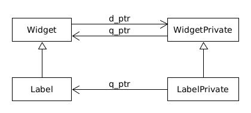

# D-Pointer and Q-Pointer

In this folder I show an example of D-Pointer which is commonly used in Qt development. For clarity I do not use the Qt macros Q_D and Q_Q.

A D-Pointer is an implementation of the Pimpl (Pointer to implementation) idiom. It is a way to separate the declaration of a component from its implementation in order tu guarantee binary compatibility.

